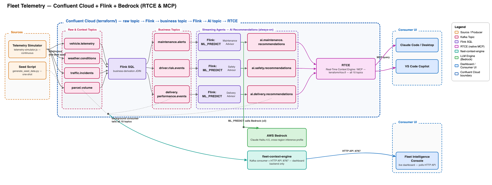
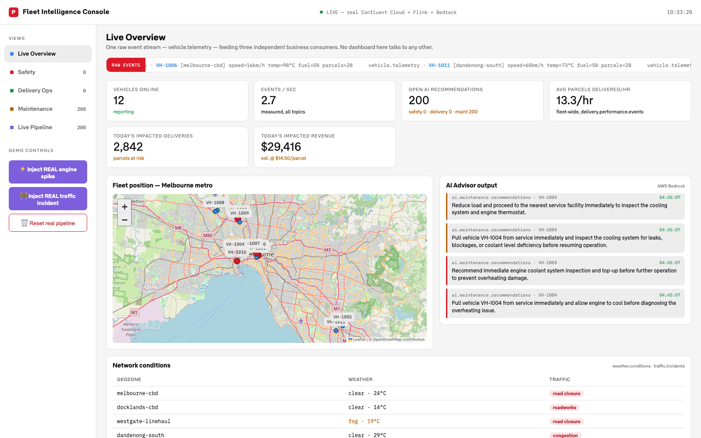

# Fleet Telemetry Demo Package

Everything built for this project, in one folder. This README is the accurate,
battle-tested path to redeploy the whole thing end-to-end.

## Architecture

Sources produce onto 4 raw/context topics, which Flink joins into 3 business-derivation topics,
each feeding its own `ML_PREDICT` statement against OpenAI to produce a recommendation topic.
`fleet-context-engine` tails all 10 topics in the background and exposes that state as an HTTP
API for the live dashboard — it has no MCP server of its own. Confluent Cloud's own managed RTCE
is the only MCP path into this project's data, straight from the real topics, for **Option 1:
Claude Code/Desktop** or **Option 2: GitHub Copilot**, no code from this repo involved.



Editable source for this diagram: [`docs/architecture-diagram.drawio`](docs/architecture-diagram.drawio) —
open it directly at [app.diagrams.net](https://app.diagrams.net) (File → Open From → Device), or
import it into Lucidchart (File → Import → draw.io CSV/XML).

## Final dashboard

`fleet-intelligence-console.html` in **LIVE** mode — 12 vehicles on a real Melbourne metro map,
KPI tiles, AI Advisor output straight from OpenAI, and network conditions per geozone, all
polled from `fleet-context-engine`'s API every ~3s:



## What's in here

| Folder / file | What it is |
|---|---|
| `fleet-intelligence-deck.html` | Presentation deck (open in a browser, arrow keys/scroll to navigate) — problem statement, why Confluent + real-time, solution architecture, the pipeline diagram, the end-to-end demo flow, and how to generate data for a quick live demo. |
| `fleet-intelligence-console.html` | Live dashboard — every view (Overview, Safety, Delivery, Maintenance, Live Pipeline) polls `fleet-context-engine`'s HTTP API every ~3s; there is no client-side simulation left in this file, so `fleet-context-engine` must be running (see Quickstart below). 12 vehicles plotted on a real Melbourne metro map (Leaflet + OpenStreetMap tiles, real geozone coordinates) at their real reported lat/lng, three business dashboards (Safety / Delivery / Maintenance) driven by real per-vehicle risk/performance fields, weather + traffic + parcel-volume context, business-impact KPIs (recent impacted deliveries and at-risk revenue, recomputed fresh from real incident/parcel data on every poll — see "Business-impact metrics" below), and demo buttons to trigger the AI-recommendation story live. Styled in a real-world light theme — brand colors and webfont pulled directly from a live retail site's own CSS, self-hosted here (see `fonts/`). The **Live Pipeline** tab is now a raw diagnostics view (connection state, pipeline mode/source, unfiltered recommendation feed) rather than the only real view — every tab is real now, that one's just unfiltered. |
| `terraform/` | Fully end-to-end: environment, Standard Kafka cluster (AWS, Sydney), all 10 topics + their schemas (created by Flink `CREATE TABLE`, not pre-created empty topics — see below for why), the Flink SQL business-derivation + AI-recommendation pipeline, service accounts, API keys, RBAC, Flink compute pool, the OpenAI connection + model, and Real-Time Context Engine (RTCE) enablement on all 10 topics. One `terraform apply` builds the whole backend. |
| `fleet-context-engine/` | Node.js service — background Kafka consumer + telemetry producer + a small HTTP API (`http://localhost:8787`) that the HTML console polls for every view. No MCP server of its own; RTCE (below) is the only MCP path into this data. Runs in **LIVE** mode (a background Kafka consumer tailing the real pipeline) when Confluent Cloud env vars are set, or **SIMULATED** mode otherwise — see `fleet-context-engine/SETUP.md`. In LIVE mode it also runs `telemetry-simulator.js`, a continuous background producer that keeps real telemetry/weather/traffic/parcel data flowing into Confluent Cloud (set `AUTO_TELEMETRY=false` to disable) — without it the seeded topics are a one-shot batch and go quiet a few seconds after startup. `SETUP.md` section 3 documents connecting **Option 1: Claude Code/Desktop** or **Option 2: GitHub Copilot** to Confluent Cloud's own **native managed MCP** (Real-Time Context Engine / `confluent-rtce`) — raw `list_topics`/`get_metadata`/`query_data` tools against the real topics, no code from this folder involved. |
| `seed-data/` | Python script that generates + produces realistic telemetry/weather/traffic/parcel data straight into the real topics (wire-encoded to match their schemas — plain JSON won't work, see below). |
| `confluent-fleet-eda.skill` | Packaged Claude skill capturing this whole architecture and every decision made building it — install it in a Claude Project so future conversations pick up the context automatically. |

## Quickstart (fastest path to something on screen, no Confluent Cloud setup)

```bash
cd fleet-context-engine && npm install && npm start   # leave running in one terminal
open ../fleet-intelligence-console.html            # in another
```
Every view in the console (not just Live Pipeline) now polls `fleet-context-engine`'s HTTP API —
there's no client-side simulation left in the HTML file itself, so that server has to be running
for the console to show anything. With no Confluent Cloud env vars set, `fleet-context-engine` falls
back to its own in-memory **SIMULATED** engine (clearly labeled as such in the console's
connection status), which is enough to see moving vehicles, a raw-event ticker, three dashboards,
weather/traffic context, and the "Inject engine spike" / "Inject traffic incident" buttons with
zero Confluent Cloud setup.

Everything past this point is for the real Confluent Cloud + Flink + OpenAI backend, which turns
that same console into a **LIVE** view of the real pipeline.

## Prerequisites

- A Confluent Cloud organization, **with a credit card on file**. This isn't optional: the
  Standard Kafka cluster and the Flink compute pool this project needs both return
  `402 Payment Required: No credit card on file` without one, even though Basic-tier trial
  credit usually exists. Add one under Billing & payment in the Confluent Cloud console before
  running Terraform.
- An OpenAI API key (platform.openai.com → API keys). No cloud console setup needed beyond
  that — unlike Bedrock, there's no separate model-access or IAM step.
- `terraform` >= 1.5, `python3`, and Node.js (for `fleet-context-engine` and `seed-data`).

## Credentials required

Two sets of credentials go into `terraform/terraform.tfvars`; a third, optional one is only
needed if you also want Claude Code/Desktop or Copilot querying the raw topics directly via RTCE.

```bash
cd terraform
cp terraform.tfvars.example terraform.tfvars
```
Edit `terraform.tfvars` and fill in real values (this file is gitignored — never paste secrets
into chat or commit them):
```hcl
confluent_cloud_api_key    = "..."   # Confluent Cloud -> Administration -> API keys -> + Add API key
                                      # -> resource scope "Cloud resource management"
confluent_cloud_api_secret = "..."
openai_api_key              = "..."  # platform.openai.com -> API keys
```

| Credential | Used for | Scope |
|---|---|---|
| `confluent_cloud_api_key` / `_secret` | Terraform provider — creates everything in `terraform/` | Cloud resource management, organization-level |
| `openai_api_key` | Flink's OpenAI connection (`ML_PREDICT`) | Standard OpenAI API key |
| Confluent RTCE Basic-auth token (optional) | `.vscode/mcp.json`, lets Claude Code/Desktop or Copilot query raw topics directly | Global-scoped Confluent API key; never written to disk — VS Code prompts for it via an `input` variable the first time the `confluent-rtce` server starts, and caches it in its own secret storage (see `fleet-context-engine/SETUP-RTCE-COPILOT.md`) |

## Setup steps

### Step 1 — Deploy

```bash
cd terraform
terraform init
terraform plan
terraform apply
```

This creates ~50 resources: environment, Standard Kafka cluster, 4 service accounts + API keys,
RBAC role bindings, the Flink compute pool (sized at 10 CFU — this pipeline runs 6 continuous
streaming statements, which exhausts the more commonly-recommended 5 CFU and leaves one job
stuck `PENDING` forever), the OpenAI connection, all 10 topics (created via Flink `CREATE
TABLE ... WITH ('value.format' = 'json-registry')`, which registers each topic's JSON schema at
creation time), the 3 business-derivation SQL jobs, the OpenAI model, the 3
AI-recommendation SQL jobs, and RTCE enablement on all 10 topics.

**Expect to run `terraform apply` more than once.** Two things you'll likely see, both harmless:
- **Transient DNS/connection errors** to `*.confluent.cloud` hosts that succeed on a plain
  retry — this happens intermittently against Confluent Cloud's REST/Flink APIs; it isn't a
  config problem, just re-run `terraform apply`.
- **A resource shows "tainted" and wants to be destroyed/recreated even though it's actually
  running fine** — this happens when the DNS flakiness above hits during the final
  provisioning-check step rather than the create call itself. Check the resource's real status
  (Confluent Cloud console, or the Flink statement's status via the API) before letting
  Terraform destroy something that's actually healthy; `terraform untaint <resource>` if so.

**Why topics are created by Flink, not `confluent_kafka_topic`:** a topic created empty (no
schema) is permanently treated by Flink as `'raw'` format — a single opaque bytes column — and
`raw` format only accepts one flat scalar column, so real JSON parsing (nested objects, arrays)
is impossible on it. Registering a schema afterward doesn't fix this once Flink has cached the
topic as raw, no matter when you do it relative to the topic's creation or first message. Flink
`CREATE TABLE ... WITH ('value.format' = 'json-registry')` is the only approach that reliably
works, because it creates the topic and its schema together from the start.

### Step 2 — Seed data into the real topics

The 4 raw/context topics (`vehicle.telemetry`, `weather.conditions`, `traffic.incidents`,
`parcel.volume`) need real messages for the pipeline to have anything to process. Because these
topics use `'value.format' = 'json-registry'`, messages must be wire-encoded (Confluent's
magic-byte + schema-ID framing) — plain JSON piped into `confluent kafka topic produce` will
**not** deserialize correctly. Use the provided script instead, which handles the encoding:

```bash
cd terraform
export KAFKA_REST_ENDPOINT="$(terraform output -raw kafka_rest_endpoint)"
export KAFKA_CLUSTER_ID="$(terraform output -raw kafka_cluster_id)"
export KAFKA_API_KEY="$(terraform output -raw app_manager_kafka_api_key)"
export KAFKA_API_SECRET="$(terraform output -raw app_manager_kafka_api_secret)"
export SCHEMA_REGISTRY_ENDPOINT="$(terraform output -raw schema_registry_rest_endpoint)"
export SCHEMA_REGISTRY_API_KEY="$(terraform output -raw app_manager_schema_registry_api_key)"
export SCHEMA_REGISTRY_API_SECRET="$(terraform output -raw app_manager_schema_registry_api_secret)"
cd ../seed-data
python3 generate_seed_data.py --produce
```
This writes 485 records (200 telemetry, 60 weather, 25 traffic, 200 parcel-volume) directly to
Confluent Cloud, wire-encoded to match each topic's schema, and also drops the same data as
`out/*.jsonl` for reference. Expect this to take a few minutes (485 sequential HTTP produce
calls). Within roughly a minute after it finishes, the business-derivation jobs will have
produced alerts/events, and shortly after that the AI jobs will have called OpenAI and written
real recommendations.

### Step 3 — Run fleet-context-engine (LIVE mode)

```bash
cd fleet-context-engine
npm install
export KAFKA_BOOTSTRAP_ENDPOINT="$(cd ../terraform && terraform output -raw kafka_bootstrap_endpoint)"
export KAFKA_REST_ENDPOINT="$(cd ../terraform && terraform output -raw kafka_rest_endpoint)"
export KAFKA_CLUSTER_ID="$(cd ../terraform && terraform output -raw kafka_cluster_id)"
export KAFKA_API_KEY="$(cd ../terraform && terraform output -raw app_manager_kafka_api_key)"
export KAFKA_API_SECRET="$(cd ../terraform && terraform output -raw app_manager_kafka_api_secret)"
export SCHEMA_REGISTRY_ENDPOINT="$(cd ../terraform && terraform output -raw schema_registry_rest_endpoint)"
export SCHEMA_REGISTRY_API_KEY="$(cd ../terraform && terraform output -raw app_manager_schema_registry_api_key)"
export SCHEMA_REGISTRY_API_SECRET="$(cd ../terraform && terraform output -raw app_manager_schema_registry_api_secret)"
npm start
```
Check stderr for `mode: LIVE (real Confluent Cloud + Flink + OpenAI)`, plus periodic
`[fleet-telemetry-simulator]` lines — that's `telemetry-simulator.js` continuously producing fresh
real telemetry so the pipeline doesn't go quiet between demo-button clicks (see the table above;
`AUTO_TELEMETRY=false` to disable it). The background Kafka consumer takes ~15-30s to catch up on
first connect. Full detail on how LIVE mode actually works is in `fleet-context-engine/SETUP.md`
— this process has no MCP server of its own; see "Optional: connecting to Confluent's native RTCE"
below for **Option 1: Claude Desktop/Code** or **Option 2: VS Code Copilot**.

With this running, reopen `fleet-intelligence-console.html` — every tab (Overview, Safety,
Delivery, Maintenance) now polls this server's `http://localhost:8787` API every ~3s and shows
real data end-to-end, including the Maintenance view's **Open work orders** tile (real
`maintenance.alerts` data). **Live Pipeline** is a raw diagnostics tab on top of that same
API — connection state, pipeline mode/source, and the unfiltered recommendation feed across all
three domains — useful for confirming the consumer's caught up, not the only real view anymore.
This is the screenshot at the top of this README.

#### Business-impact metrics (Overview tab)

"Recent impacted deliveries" and "Recent impacted revenue" quantify the AI-recommendation
story in business terms, not just event counts. Both are computed client-side in the console,
recomputed fresh on every 3s poll from the currently-fetched incident window
(`/api/traffic-incidents?limit=30`) intersected against real vehicles/parcel load:
- **Impacted deliveries** = for each incident in that window, the current parcel count of every
  vehicle sitting in that incident's geozone (every parcel on board is now a delivery at risk of
  missing its window), summed across incidents.
- **Impacted revenue** = parcel count × **$14.50/parcel** (a documented placeholder assumption —
  there's no real pricing data source in this demo) × a severity weight (high=100%, medium=60%,
  low=35%, reflecting that a "congestion" disruption usually still completes, while a "collision
  reported/road closure" more often means a genuinely missed delivery).

An earlier version accumulated every distinct geozone+timestamp incident into a running "today"
total for as long as the browser tab stayed open, which climbed to implausible numbers within
minutes since `telemetry-simulator.js` manufactured a fresh incident every 30-90s at the time.
Recomputing fresh each poll instead bounds the number to the current incident window and lets it
fall as old incidents age out, not just rise — "Recent," not "Today's," is the accurate label for
that reason. Separately, the ambient incident rate itself was lowered to ~1 every 5 minutes (was
~75s average) since 6 geozones / 12 vehicles at the old rate kept nearly the whole fleet sitting
in a "recently incident-hit" zone at any given moment.

#### Optional: connecting to Confluent's native Real-Time Context Engine (RTCE)

All 10 topics are already RTCE-enabled by `terraform/rtce.tf`. This is the **only** MCP path into
this project's data — `fleet-context-engine` has no MCP server of its own. Full steps, including
the Global-API-key auth gotcha that returns a 401 on regular scoped keys, are in
`fleet-context-engine/SETUP-RTCE-COPILOT.md` (**Option 2: VS Code Copilot**) and
`fleet-context-engine/SETUP.md` section 3 (**Option 1: Claude Desktop/Code**).

### Step 4 (optional) — Claude skill for future sessions

Upload `confluent-fleet-eda.skill` to your Claude Project so this architecture and every
decision made (AWS Sydney, the real brand tokens, the
three-domain fan-out pattern, Standard cluster not Basic, Flink-creates-topics not Terraform) is
remembered automatically in future conversations.

## Fixed project decisions (don't relitigate these without a reason)

- **Cloud/region:** AWS, `ap-southeast-2` (Sydney) — cluster and Flink compute pool both.
- **Cluster tier:** Standard, not Basic — Basic rejects fine-grained RBAC resource roles
  scoped to individual topics/groups ("Basic Clusters can not use resource roles"), which
  `topics.tf` needs.
- **AI backend:** OpenAI (`terraform/variables.tf`'s `openai_model_id`, default `gpt-4o-mini`)
  via a Flink `OPENAI`-type connection — originally AWS Bedrock, switched because it needed no
  separate cloud-console/IAM setup and no AWS account at all.
- **Brand:** the console's colors and font are *real* design tokens, pulled directly from a live
  retail site's own CSS (`--brand-red-500 #DC1928`, `--system-*` semantic colors,
  `--neutral-*` scale) and the real `APTypeProText` webfont (self-hosted in `fonts/`, downloaded
  from that site since it isn't CORS-enabled for hotlinking) — not an approximation. Console
  theme is light, matching the predominantly white layout of the real site; the separate
  `fleet-intelligence-deck.html` presentation deliberately keeps its own dark theme regardless
  (a distinct design choice, documented in that file), but was updated to the same real red.
- **Business domains:** always Safety / Delivery Operations / Fleet Maintenance — kept as three
  separate topics and dashboards on purpose, to prove independent, decoupled consumers.
- **Topics are created by Flink (`CREATE TABLE`), not `confluent_kafka_topic`** — see Setup
  Step 2 for why; this is load-bearing, not a style preference.
- **RTCE is enabled via Terraform (`terraform/rtce.tf`), not the `confluent rtce rtce-topic
  create` CLI** — kept in sync with the other 10 topics' lifecycle, and the credential to query
  it (`.vscode/mcp.json`) is externalized as a VS Code `input` variable rather than stored in
  plaintext (see Credentials required above).
